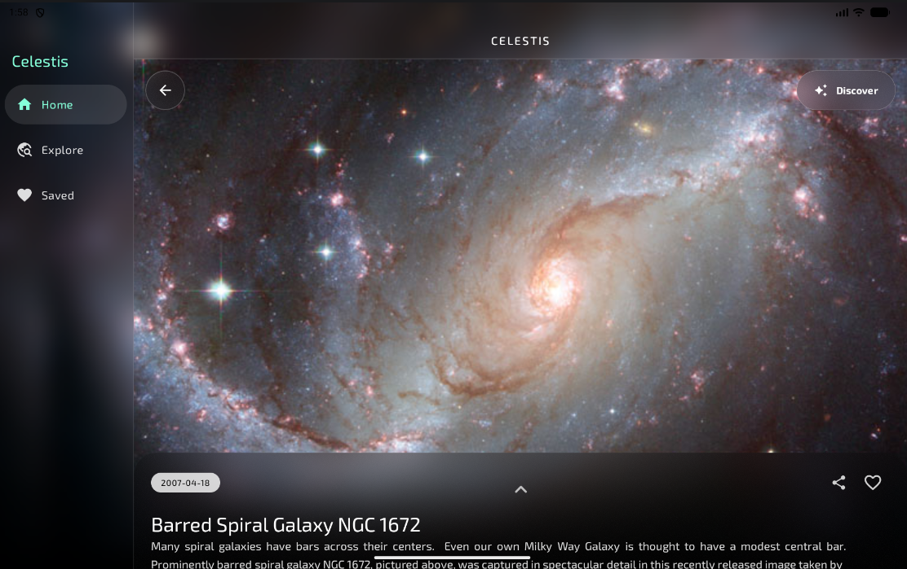
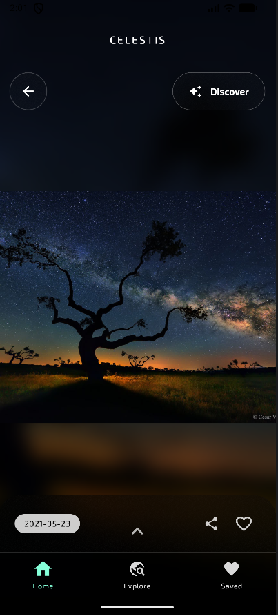
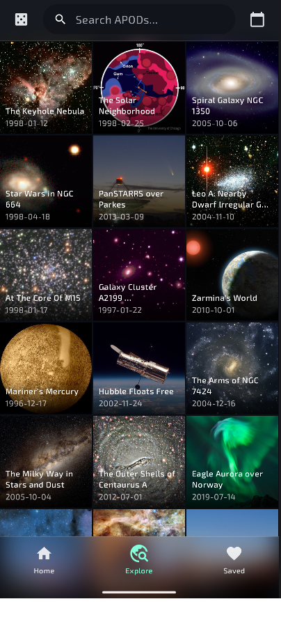
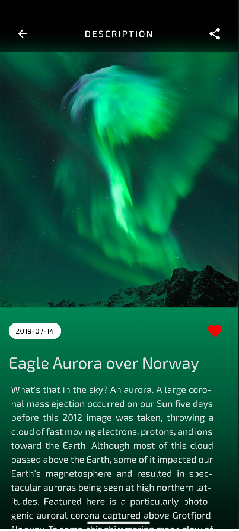
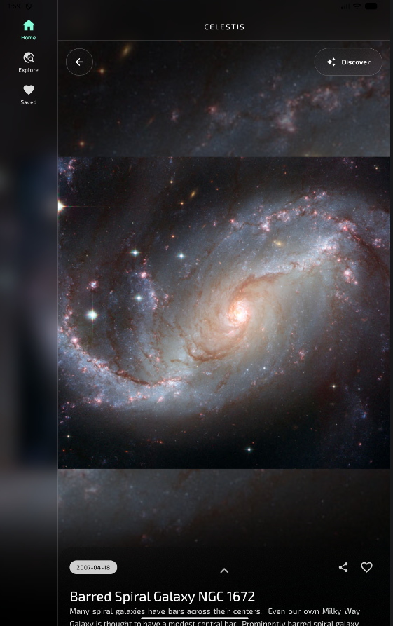
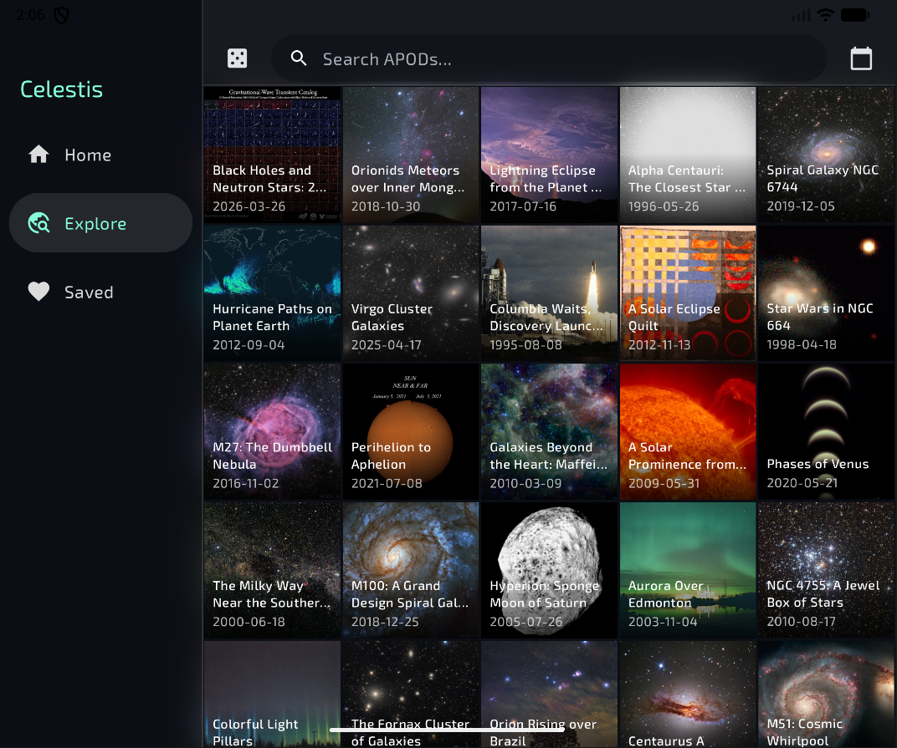
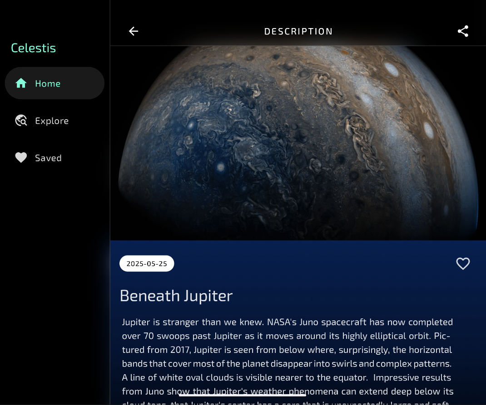

# Celestis

Celestis is a cross-platform mobile application for exploring NASA's Astronomy Picture of the Day. It is built with Kotlin Multiplatform and Compose Multiplatform, sharing core application logic and UI across Android and iOS while still using platform-specific integrations where they make sense.

The project combines a polished mobile experience with an accompanying Kotlin backend deployed on Google Cloud Run. The mobile app presents APOD content through daily views, discovery tools, favorites, widgets, background updates, and offline-aware data handling.

## Highlights

- Cross-platform Android and iOS application built with Kotlin Multiplatform
- Shared Compose Multiplatform UI with adaptive layouts for phones, tablets, foldables, and landscape views
- Daily APOD experience with image and video support
- Random discovery flow with image prefetching for fast browsing
- Search and date-range exploration with paginated loading
- Local favorites and offline-first behavior backed by SQLDelight
- Android home-screen widget built with Jetpack Glance
- iOS widget built with WidgetKit and SwiftUI
- Background sync flows for keeping cached APOD content and widgets current
- Companion Kotlin Ktor backend for APOD proxying, MongoDB caching, search, ratings, and notification workflows

## Screenshots

Celestis adapts from compact phone layouts to larger tablet, landscape, and foldable experiences while preserving the same shared Compose Multiplatform UI.

<p align="center">
  
</p>

<p align="center">
  
  
  
  
</p>

<p align="center">
  
  
</p>

## Architecture

```text
composeApp/
  src/commonMain/    Shared Compose UI, models, repositories, view models, navigation, and utilities
  src/androidMain/   Android-specific services, widgets, media playback, sync, and platform adapters
  src/iosMain/       iOS-specific services, sync, sharing, widgets bridge code, and platform adapters

iosApp/
  iosApp/            Native iOS app entry point
  CelestisWidget/    WidgetKit extension
```

Celestis uses a layered mobile architecture:

- `ViewModels` manage screen state and user interactions.
- `ApodRepository` coordinates local cache reads, remote API calls, favorites, random discovery, and search behavior.
- SQLDelight stores APOD metadata, cached content, and favorites locally.
- Ktor handles network communication with the Celestis backend.
- Coil handles image loading, caching, and prefetching.
- Koin provides dependency injection across shared and platform-specific modules.

## Backend

The mobile app is paired with a separate Kotlin Ktor backend:

[apod-proxy-server](https://github.com/alex-stephen/apod-proxy-server)

The backend is designed to sit between the app and NASA's APOD API. It provides cached APOD retrieval, random and date-range endpoints, search support, rating updates, background cache warming, and mobile notification workflows.

## Tech Stack

- Kotlin Multiplatform
- Compose Multiplatform
- Kotlin Coroutines and Flow
- SQLDelight
- Ktor
- Coil
- Koin
- Jetpack Glance
- WidgetKit / SwiftUI
- MongoDB-backed Kotlin Ktor backend
- Google Cloud Run
